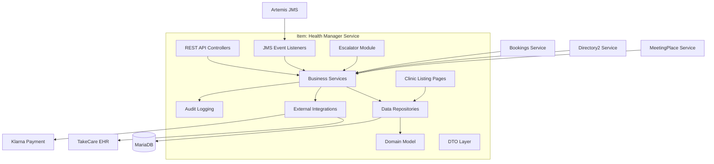
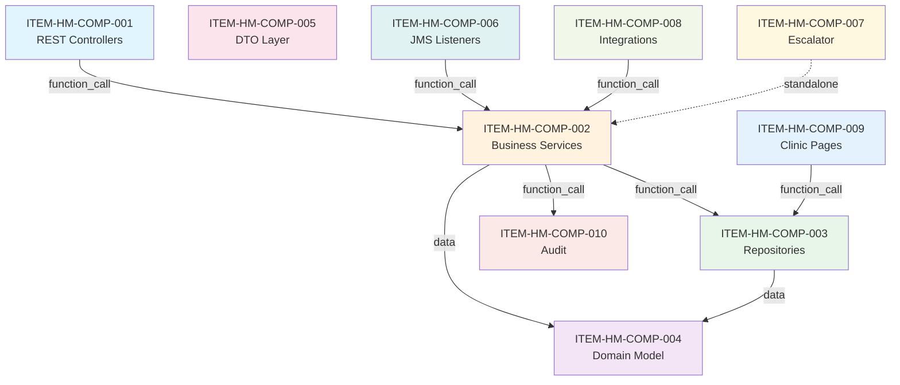

---
id:
title: "Item Architecture - Health Manager Service"
version:
author:
effective_date:
type: "Architecture"
document_id: "ITEM-ARCH-HM-1.0"
level: "item"
process: "[Software Development Process](../../../../Canvases/Software%20Development%20Process.canvas)"
requirements: "[IEC 62304](../../../../Requirements/IEC_62304_Requirements.md)"
owner: "[Head of Quality Management](../../../../Assets/Head%20of%20Quality%20Management.md)"
---

# Item Architecture

## Health Manager Service

**Software Item:** health-manager
**Repository:** https://gitlab.com/doktor24/services/health-manager.git
**Version/Commit:** 16e0273739eda65f73af5410323e1caf53362f16
**Safety Classification:** Class B
**Primary Technology:** Java 21 / Spring Boot
**Architectural Style:** layered
**Extraction Date:** 2026-03-06

---

## Important Notice

> This is an **ITEM-LEVEL** document.
>
> This document describes the architecture of **Health Manager Service** only.
> It is NOT a Software Architecture Design (SAD).
>
> For complete architecture documentation, see the **System-Level** documents:
> - Software Architecture Design: `SYS-SAD-platform24-[version].md`
> - System Architecture: `SYS-ARCH-platform24-[version].md`

---

## 1. Overview

### 1.1 Architecture Summary

| Metric | Value |
|--------|-------|
| Components | 10 |
| Provided Interfaces | 5 |
| Consumed Interfaces | 7 |
| SOUP Dependencies | 12 |
| Entry Points | 3 |
| Data Flows | 3 |

### 1.2 High-Level Diagram



### 1.3 Entry Points

| Name | Type | Path | Description |
|------|------|------|-------------|
| Spring Boot Application | http_server | svc/src/main/java/se/alerisx/mhp/manager/Application.java | Main HTTP REST API server |
| JMS Message Listeners | message_listener | svc/src/main/java/se/alerisx/mhp/manager/listener/ | Artemis JMS message consumers for async events |
| Scheduled Jobs | scheduled_job | svc/src/main/java/se/alerisx/mhp/manager/service/impl/FollowUpMessageNotificationScheduler.java | ShedLock-based scheduled tasks |

---

## 2. Components

### 2.1 Component Summary

| ID | Name | Type | Safety Class | Dependencies |
|----|------|------|--------------|--------------|
| ITEM-HM-COMP-001 | REST API Controllers | layer | B | 1 internal, 2 SOUP |
| ITEM-HM-COMP-002 | Business Services | layer | B | 2 internal, 2 SOUP |
| ITEM-HM-COMP-003 | Data Repositories | layer | B | 1 internal, 3 SOUP |
| ITEM-HM-COMP-004 | Domain Model | module | B | 0 internal, 2 SOUP |
| ITEM-HM-COMP-005 | DTO Layer | module | A | 0 internal, 2 SOUP |
| ITEM-HM-COMP-006 | JMS Event Listeners | module | B | 1 internal, 1 SOUP |
| ITEM-HM-COMP-007 | Escalator Module | subsystem | B | 0 internal, 1 SOUP |
| ITEM-HM-COMP-008 | External Integrations | module | B | 1 internal, 3 SOUP |
| ITEM-HM-COMP-009 | Clinic Listing Pages | module | A | 1 internal, 2 SOUP |
| ITEM-HM-COMP-010 | Audit Logging | module | B | 1 internal, 1 SOUP |

### 2.2 Component Details

#### ITEM-HM-COMP-001: REST API Controllers

**Type:** layer

**Path:** `svc/src/main/java/se/alerisx/mhp/manager/controller/`

**Description:** HTTP REST endpoints for appointment, practitioner, patient, clinic, and system operations

**Safety Class:** B

**Internal Dependencies:**
| Component | Dependency Type | Coupling | Description |
|-----------|-----------------|----------|-------------|
| ITEM-HM-COMP-002 | function_call | loose | Controllers delegate to service layer |

**SOUP Dependencies:**
- ITEM-HM-SOUP-001 (spring-boot-starter-web): REST controller framework
- ITEM-HM-SOUP-002 (Spring Security): Authentication/authorization

**Source Files:**
- svc/src/main/java/se/alerisx/mhp/manager/controller/v1/AppointmentController.java
- svc/src/main/java/se/alerisx/mhp/manager/controller/v1/PractitionerController.java
- svc/src/main/java/se/alerisx/mhp/manager/controller/v1/clinic/ClinicAppointmentController.java
- svc/src/main/java/se/alerisx/mhp/manager/controller/v1/patient/PatientAppointmentController.java

**Related Requirements:**
- ITEM-HM-REQ-INT-001
- ITEM-HM-REQ-INT-009
- ITEM-HM-REQ-INT-010

---

#### ITEM-HM-COMP-002: Business Services

**Type:** layer

**Path:** `svc/src/main/java/se/alerisx/mhp/manager/service/`

**Description:** Core business logic for appointments, handovers, follow-ups, referrals, billing, and escalation

**Safety Class:** B

**Internal Dependencies:**
| Component | Dependency Type | Coupling | Description |
|-----------|-----------------|----------|-------------|
| ITEM-HM-COMP-003 | function_call | loose | Services use repositories for data access |
| ITEM-HM-COMP-004 | data | tight | Services manipulate domain entities |

**SOUP Dependencies:**
- ITEM-HM-SOUP-001 (spring-boot-starter-web): Transaction management
- ITEM-HM-SOUP-004 (querydsl-jpa): Complex query building

**Source Files:**
- svc/src/main/java/se/alerisx/mhp/manager/service/UpdateAppointmentService.java
- svc/src/main/java/se/alerisx/mhp/manager/service/AppointmentHandoverService.java
- svc/src/main/java/se/alerisx/mhp/manager/service/FollowUpService.java
- svc/src/main/java/se/alerisx/mhp/manager/service/ReferralService.java
- svc/src/main/java/se/alerisx/mhp/manager/service/impl/EscalationService.java

**Related Requirements:**
- ITEM-HM-REQ-FUNC-001
- ITEM-HM-REQ-FUNC-002
- ITEM-HM-REQ-FUNC-003

---

#### ITEM-HM-COMP-003: Data Repositories

**Type:** layer

**Path:** `svc/src/main/java/se/alerisx/mhp/manager/repository/`

**Description:** Spring Data JPA repositories for database access using QueryDSL and Blaze Persistence

**Safety Class:** B

**Internal Dependencies:**
| Component | Dependency Type | Coupling | Description |
|-----------|-----------------|----------|-------------|
| ITEM-HM-COMP-004 | data | tight | Repositories persist domain entities |

**SOUP Dependencies:**
- ITEM-HM-SOUP-002 (hibernate-core): JPA implementation
- ITEM-HM-SOUP-004 (querydsl-jpa): Type-safe queries
- ITEM-HM-SOUP-005 (blaze-persistence): Enhanced pagination

**Source Files:**
- svc/src/main/java/se/alerisx/mhp/manager/repository/QueryableAppointmentRepository.java
- svc/src/main/java/se/alerisx/mhp/manager/repository/AppointmentHandoverEventRepository.java
- svc/src/main/java/se/alerisx/mhp/manager/appointments/notes/repository/NoteRepository.java

**Related Requirements:**
- ITEM-HM-REQ-DATA-001

---

#### ITEM-HM-COMP-004: Domain Model

**Type:** module

**Path:** `svc/src/main/java/se/alerisx/mhp/manager/domain/`

**Description:** JPA entities representing appointments, episodes, handovers, flags, notes, and booking data

**Safety Class:** B

**Internal Dependencies:** None

**SOUP Dependencies:**
- ITEM-HM-SOUP-002 (hibernate-core): JPA annotations
- ITEM-HM-SOUP-006 (lombok): Boilerplate reduction

**Source Files:**
- svc/src/main/java/se/alerisx/mhp/manager/domain/Appointment.java
- svc/src/main/java/se/alerisx/mhp/manager/domain/EpisodeOfCare.java
- svc/src/main/java/se/alerisx/mhp/manager/domain/FollowUp.java
- svc/src/main/java/se/alerisx/mhp/manager/domain/flag/v2/Flag.java

---

#### ITEM-HM-COMP-005: DTO Layer

**Type:** module

**Path:** `dto/src/main/java/se/alerisx/mhp/manager/dto/`

**Description:** Data Transfer Objects for API request/response and inter-service communication

**Safety Class:** A

**Internal Dependencies:** None

**SOUP Dependencies:**
- ITEM-HM-SOUP-006 (lombok): Boilerplate reduction
- ITEM-HM-SOUP-012 (jackson-datatype-jsr310): Date serialization

**Source Files:**
- dto/src/main/java/se/alerisx/mhp/manager/dto/AppointmentDTO.java
- dto/src/main/java/se/alerisx/mhp/manager/dto/HandoverMessageDTO.java
- dto/src/main/java/se/alerisx/mhp/manager/dto/UpdateAppointmentDTO.java

---

#### ITEM-HM-COMP-006: JMS Event Listeners

**Type:** module

**Path:** `svc/src/main/java/se/alerisx/mhp/manager/listener/`

**Description:** Artemis JMS message consumers for synchronized bookings, patient events, and message events

**Safety Class:** B

**Internal Dependencies:**
| Component | Dependency Type | Coupling | Description |
|-----------|-----------------|----------|-------------|
| ITEM-HM-COMP-002 | function_call | loose | Listeners delegate to services |

**SOUP Dependencies:**
- ITEM-HM-SOUP-003 (spring-boot-starter-artemis): JMS integration

**Source Files:**
- svc/src/main/java/se/alerisx/mhp/manager/listener/SynchronizedBookingListener.java
- svc/src/main/java/se/alerisx/mhp/manager/listener/MessageEventListener.java
- svc/src/main/java/se/alerisx/mhp/manager/listener/PatientChildCanSeekCareListener.java

**Related Requirements:**
- ITEM-HM-REQ-INT-002

---

#### ITEM-HM-COMP-007: Escalator Module

**Type:** subsystem

**Path:** `modules/escalator/`

**Description:** Appointment escalation rules engine using easy-rules for clinical priority management

**Safety Class:** B

**Internal Dependencies:** None (standalone module)

**SOUP Dependencies:**
- ITEM-HM-SOUP-007 (easy-rules-core): Rules engine

**Source Files:**
- modules/escalator/src/main/java/

**Related Requirements:**
- ITEM-HM-REQ-FUNC-010

---

#### ITEM-HM-COMP-008: External Integrations

**Type:** module

**Path:** `svc/src/main/java/se/alerisx/mhp/manager/takecare/`

**Description:** Integration with external systems: TakeCare EHR, Alfa e-Recept, Klarna payments, Freepass

**Safety Class:** B

**Internal Dependencies:**
| Component | Dependency Type | Coupling | Description |
|-----------|-----------------|----------|-------------|
| ITEM-HM-COMP-002 | function_call | loose | Integrations called by services |

**SOUP Dependencies:**
- ITEM-HM-SOUP-008 (kco-rest): Klarna SDK
- ITEM-HM-SOUP-011 (mysql-connector-j): Database driver

**Source Files:**
- svc/src/main/java/se/alerisx/mhp/manager/takecare/TakeCareNoteService.java
- svc/src/main/java/se/alerisx/mhp/manager/order/klarna/

**Related Requirements:**
- ITEM-HM-REQ-INT-007

---

#### ITEM-HM-COMP-009: Clinic Listing Pages

**Type:** module

**Path:** `svc/src/main/java/se/alerisx/mhp/manager/service/clinicpages/`

**Description:** Complex query builders for clinic appointment lists, billing, and consultation views

**Safety Class:** A

**Internal Dependencies:**
| Component | Dependency Type | Coupling | Description |
|-----------|-----------------|----------|-------------|
| ITEM-HM-COMP-003 | function_call | tight | Uses repositories with QueryDSL |

**SOUP Dependencies:**
- ITEM-HM-SOUP-004 (querydsl-jpa): Query building
- ITEM-HM-SOUP-005 (blaze-persistence): Pagination

**Source Files:**
- svc/src/main/java/se/alerisx/mhp/manager/service/clinicpages/ConsultationListService.java
- svc/src/main/java/se/alerisx/mhp/manager/service/clinicpages/BillingListService.java

**Related Requirements:**
- ITEM-HM-REQ-FUNC-009

---

#### ITEM-HM-COMP-010: Audit Logging

**Type:** module

**Path:** `svc/src/main/java/se/alerisx/mhp/manager/service/audit/`

**Description:** Clinical audit trail logging using Platform24 audit SDK

**Safety Class:** B

**Internal Dependencies:**
| Component | Dependency Type | Coupling | Description |
|-----------|-----------------|----------|-------------|
| ITEM-HM-COMP-002 | function_call | loose | Services invoke audit logging |

**SOUP Dependencies:**
- ITEM-HM-SOUP-010 (alerisx-audit-logging-sdk): Audit framework

**Source Files:**
- svc/src/main/java/se/alerisx/mhp/manager/service/audit/AuditLoggingService.java

**Related Requirements:**
- ITEM-HM-REQ-SEC-005

---

## 3. Component Dependency Diagram



---

## 4. Provided Interfaces

Interfaces this item EXPOSES to other items/systems.

### 4.1 Summary

| ID | Name | Type | Protocol | Component |
|----|------|------|----------|-----------|
| ITEM-HM-INT-001 | Appointment Management API | rest_api | HTTP | ITEM-HM-COMP-001 |
| ITEM-HM-INT-002 | Clinic Appointment API | rest_api | HTTP | ITEM-HM-COMP-001 |
| ITEM-HM-INT-003 | Handover Events | jms_topic | JMS | ITEM-HM-COMP-002 |
| ITEM-HM-INT-004 | Follow-Up API | rest_api | HTTP | ITEM-HM-COMP-001 |
| ITEM-HM-INT-005 | Referral API | rest_api | HTTP | ITEM-HM-COMP-001 |

### 4.2 Interface Details

#### ITEM-HM-INT-001: Appointment Management API

**Type:** rest_api

**Direction:** Provided

**Protocol:** HTTP

**Description:** REST API for appointment CRUD, status updates, and lifecycle management

**Contract:**
- **Endpoint:** `/v1/appointments/*`
- **Method:** GET, POST, PUT, PATCH
- **Request Schema:**
```json
{
  "UpdateAppointmentDTO": {
    "action": "string",
    "appointmentData": "object"
  }
}
```
- **Response Schema:**
```json
{
  "AppointmentDTO": {
    "id": "string",
    "status": "string",
    "patientId": "string",
    "practitionerId": "string"
  }
}
```
- **Error Codes:**
  - 400: Invalid request
  - 403: Forbidden
  - 404: Appointment not found

**Provided by Component:** ITEM-HM-COMP-001

**Known Consumers:** clinic-web, patient-app, booking-service

**Source:**
- svc/src/main/java/se/alerisx/mhp/manager/controller/v1/AppointmentController.java

---

#### ITEM-HM-INT-003: Handover Events

**Type:** jms_topic

**Direction:** Provided

**Protocol:** JMS

**Description:** JMS events for appointment handover status changes

**Contract:**
- **Endpoint:** `AppointmentHandoverStatusEvent`
- **Response Schema:**
```json
{
  "appointmentId": "string",
  "handoverStatus": "PROPOSED|ACCEPTED|DENIED|CANCELLED",
  "timestamp": "ISO8601"
}
```

**Provided by Component:** ITEM-HM-COMP-002

**Known Consumers:** notification-service, clinic-web

**Source:**
- svc/src/main/java/se/alerisx/mhp/manager/service/impl/AppointmentHandoverServiceImpl.java

---

## 5. Consumed Interfaces

Interfaces this item CONSUMES from other items/systems.

### 5.1 Summary

| ID | Name | External System | Protocol | Component |
|----|------|-----------------|----------|-----------|
| ITEM-HM-EXT-001 | Bookings Service | bookings-service | HTTP | ITEM-HM-COMP-002 |
| ITEM-HM-EXT-002 | Directory2 Service | directory2-service | HTTP | ITEM-HM-COMP-002 |
| ITEM-HM-EXT-003 | Meetingplace Service | meetingplace-service | HTTP | ITEM-HM-COMP-002 |
| ITEM-HM-EXT-004 | TakeCare EHR | TakeCare (external) | HTTP/SOAP | ITEM-HM-COMP-008 |
| ITEM-HM-EXT-005 | Klarna Payment Gateway | Klarna (external) | HTTP | ITEM-HM-COMP-008 |
| ITEM-HM-EXT-006 | Synchronized Booking Events | bookings-service | JMS | ITEM-HM-COMP-006 |
| ITEM-HM-EXT-007 | MariaDB Database | MariaDB cluster | JDBC | ITEM-HM-COMP-003 |

### 5.2 Interface Details

#### ITEM-HM-EXT-001: Bookings Service

**Type:** rest_api

**Direction:** Consumed

**Protocol:** HTTP

**External System:** bookings-service

**Description:** Platform24 bookings service for slot availability and booking creation

**Contract:**
- **Endpoint:** Internal service discovery
- **Expected Schema:** BookingDTO

**Consumed by Component:** ITEM-HM-COMP-002

**Failure Handling:** Retry with exponential backoff, circuit breaker

**Source:**
- pom.xml:bookings.version

---

#### ITEM-HM-EXT-006: Synchronized Booking Events

**Type:** jms_topic

**Direction:** Consumed

**Protocol:** JMS

**External System:** bookings-service

**Description:** Booking sync events from bookings service

**Contract:**
- **Endpoint:** SynchronizedBookingEvent topic
- **Expected Schema:** SynchronizedBookingEvent

**Consumed by Component:** ITEM-HM-COMP-006

**Failure Handling:** Dead letter queue, manual intervention

**Source:**
- svc/src/main/java/se/alerisx/mhp/manager/listener/SynchronizedBookingListener.java

---

#### ITEM-HM-EXT-007: MariaDB Database

**Type:** database

**Direction:** Consumed

**Protocol:** JDBC

**External System:** MariaDB cluster

**Description:** Primary relational database for appointment and clinical data

**Contract:**
- **Endpoint:** JDBC connection
- **Expected Schema:** Health Manager schema

**Consumed by Component:** ITEM-HM-COMP-003

**Failure Handling:** Connection pooling, retry, failover to replica

**Source:**
- pom.xml:mariadb-java-client

---

## 6. SOUP Dependencies

### 6.1 Summary

| ID | Name | Version | Purpose | Safety Relevant |
|----|------|---------|---------|-----------------|
| ITEM-HM-SOUP-001 | spring-boot-starter-web | inherited | REST API framework | yes |
| ITEM-HM-SOUP-002 | hibernate-core | inherited | JPA ORM | yes |
| ITEM-HM-SOUP-003 | spring-boot-starter-artemis | inherited | JMS messaging | yes |
| ITEM-HM-SOUP-004 | querydsl-jpa | inherited | Type-safe queries | no |
| ITEM-HM-SOUP-005 | blaze-persistence | 1.6.11 | Enhanced pagination | no |
| ITEM-HM-SOUP-006 | lombok | 1.18.30 | Boilerplate reduction | no |
| ITEM-HM-SOUP-007 | easy-rules-core | 3.4.0 | Rules engine | yes |
| ITEM-HM-SOUP-008 | kco-rest | 4.0.3 | Klarna SDK | no |
| ITEM-HM-SOUP-010 | alerisx-audit-logging-sdk | 2.84.0 | Audit logging | yes |
| ITEM-HM-SOUP-011 | mysql-connector-j | 8.4.0 | JDBC driver | yes |
| ITEM-HM-SOUP-012 | jackson-datatype-jsr310 | inherited | Date serialization | yes |

### 6.2 Dependencies by Component

| Component | SOUP Dependencies |
|-----------|-------------------|
| ITEM-HM-COMP-001 | SOUP-001, SOUP-002 |
| ITEM-HM-COMP-002 | SOUP-001, SOUP-004 |
| ITEM-HM-COMP-003 | SOUP-002, SOUP-004, SOUP-005 |
| ITEM-HM-COMP-004 | SOUP-002, SOUP-006 |
| ITEM-HM-COMP-005 | SOUP-006, SOUP-012 |
| ITEM-HM-COMP-006 | SOUP-003 |
| ITEM-HM-COMP-007 | SOUP-007 |
| ITEM-HM-COMP-008 | SOUP-008, SOUP-011 |
| ITEM-HM-COMP-009 | SOUP-004, SOUP-005 |
| ITEM-HM-COMP-010 | SOUP-010 |

### 6.3 License Summary

| License | Count | Compatible |
|---------|-------|------------|
| Apache-2.0 | 35 | Yes |
| MIT | 5 | Yes |
| LGPL-2.1 | 2 | Yes |
| GPL-2.0 | 1 | Review |
| Proprietary | 5 | Yes |

> For detailed SOUP information, see: `Item-SOUP-List.md`

---

## 7. Data Flows

### 7.1 Summary

| ID | Name | Safety Relevant | Path |
|----|------|-----------------|------|
| ITEM-HM-FLOW-001 | Appointment Update Flow | yes | COMP-001 -> COMP-002 -> COMP-003 -> COMP-004 |
| ITEM-HM-FLOW-002 | Handover Flow | yes | COMP-001 -> COMP-002 -> COMP-003 -> COMP-006 |
| ITEM-HM-FLOW-003 | JMS Event Processing | yes | COMP-006 -> COMP-002 -> COMP-003 |

### 7.2 Flow Details

#### ITEM-HM-FLOW-001: Appointment Update Flow

**Description:** Patient/practitioner appointment status changes through the system

**Data Type:** Appointment status and clinical data

**Safety Relevant:** yes

**Path:**
```
ITEM-HM-COMP-001 (Controllers) -> ITEM-HM-COMP-002 (Services) -> ITEM-HM-COMP-003 (Repositories) -> ITEM-HM-COMP-004 (Domain)
```

**Data Transformations:**
- At COMP-001: DTO validation and conversion
- At COMP-002: Business rule validation, state machine checks
- At COMP-003: Entity persistence, optimistic locking

---

#### ITEM-HM-FLOW-002: Handover Flow

**Description:** Appointment handover between practitioners

**Data Type:** Handover status and practitioner assignments

**Safety Relevant:** yes

**Path:**
```
ITEM-HM-COMP-001 -> ITEM-HM-COMP-002 -> ITEM-HM-COMP-003 -> ITEM-HM-COMP-006 (JMS publish)
```

**Data Transformations:**
- At COMP-002: Handover state machine validation
- At COMP-006: Event publication to JMS topic

---

#### ITEM-HM-FLOW-003: JMS Event Processing

**Description:** Incoming booking sync events from external services

**Data Type:** Booking synchronization events

**Safety Relevant:** yes

**Path:**
```
ITEM-HM-COMP-006 (JMS Listener) -> ITEM-HM-COMP-002 (Services) -> ITEM-HM-COMP-003 (Repositories)
```

**Data Transformations:**
- At COMP-006: Event deserialization, duplicate detection
- At COMP-002: Business logic application
- At COMP-003: Database persistence

---

## 8. Safety Segregation

### 8.1 Applicability

**Applicable:** yes

**Rationale:** Safety Class B software requires segregation between safety-relevant and non-safety-relevant components

### 8.2 Segregation Mechanisms

#### Mechanism 1: Module Boundary

**Type:** module_boundary

**Description:** Layered architecture separates concerns: controllers, services, repositories, domain

**Protected Components:**
- ITEM-HM-COMP-002 (Business Services)
- ITEM-HM-COMP-003 (Data Repositories)

**Verification:** Code review, dependency analysis

---

#### Mechanism 2: Process Isolation

**Type:** process_isolation

**Description:** External integrations (TakeCare, Klarna) are isolated in dedicated components

**Protected Components:**
- ITEM-HM-COMP-008 (External Integrations)

**Verification:** Integration tests with mocks

### 8.3 Failure Propagation Controls

- Circuit breaker pattern for external service calls
- Transaction boundaries prevent partial data commits
- Dead letter queue for JMS message processing failures
- Retry with exponential backoff for transient failures

---

## 9. Gaps and Issues

### 9.1 Summary

| Priority | Count |
|----------|-------|
| High | 0 |
| Medium | 0 |
| Low | 1 |

### 9.2 Gap Details

| ID | Type | Description | Affected | Priority | Recommendation |
|----|------|-------------|----------|----------|----------------|
| ITEM-HM-ARCH-GAP-001 | undocumented_component | Plugin service integrations not fully documented | ITEM-HM-COMP-008 | low | Document plugin-service-client integration patterns |

---

## 10. Traceability

### 10.1 Component to Requirements

| Component | Requirements |
|-----------|--------------|
| ITEM-HM-COMP-001 | ITEM-HM-REQ-INT-001, ITEM-HM-REQ-INT-009, ITEM-HM-REQ-INT-010 |
| ITEM-HM-COMP-002 | ITEM-HM-REQ-FUNC-001, ITEM-HM-REQ-FUNC-002, ITEM-HM-REQ-FUNC-003 |
| ITEM-HM-COMP-006 | ITEM-HM-REQ-INT-002 |
| ITEM-HM-COMP-007 | ITEM-HM-REQ-FUNC-010 |

### 10.2 Component to Source

| Component | Source Path |
|-----------|-------------|
| ITEM-HM-COMP-001 | svc/src/main/java/se/alerisx/mhp/manager/controller/ |
| ITEM-HM-COMP-002 | svc/src/main/java/se/alerisx/mhp/manager/service/ |
| ITEM-HM-COMP-003 | svc/src/main/java/se/alerisx/mhp/manager/repository/ |
| ITEM-HM-COMP-004 | svc/src/main/java/se/alerisx/mhp/manager/domain/ |
| ITEM-HM-COMP-005 | dto/src/main/java/se/alerisx/mhp/manager/dto/ |
| ITEM-HM-COMP-006 | svc/src/main/java/se/alerisx/mhp/manager/listener/ |
| ITEM-HM-COMP-007 | modules/escalator/src/main/java/ |
| ITEM-HM-COMP-008 | svc/src/main/java/se/alerisx/mhp/manager/takecare/ |
| ITEM-HM-COMP-009 | svc/src/main/java/se/alerisx/mhp/manager/service/clinicpages/ |
| ITEM-HM-COMP-010 | svc/src/main/java/se/alerisx/mhp/manager/service/audit/ |

---

## Appendix A: Extraction Metadata

| Attribute | Value |
|-----------|-------|
| Repository | https://gitlab.com/doktor24/services/health-manager.git |
| Commit | 16e0273739eda65f73af5410323e1caf53362f16 |
| Extraction Date | 2026-03-06T15:00:00Z |
| Extractor Version | 2.0 |
| Standard | IEC 62304:2006+AMD1:2015 |

---

*This document is part of the regulatory documentation for Health Manager Service.*
*IEC 62304:2006+AMD1:2015 Clause 5.3 Compliant - Item Level*
