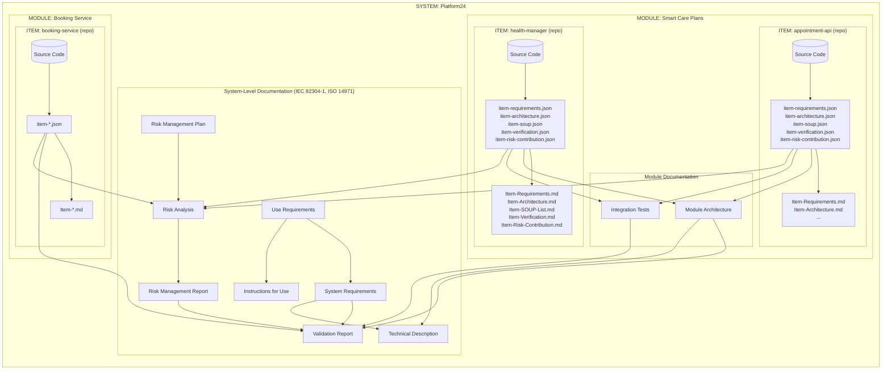
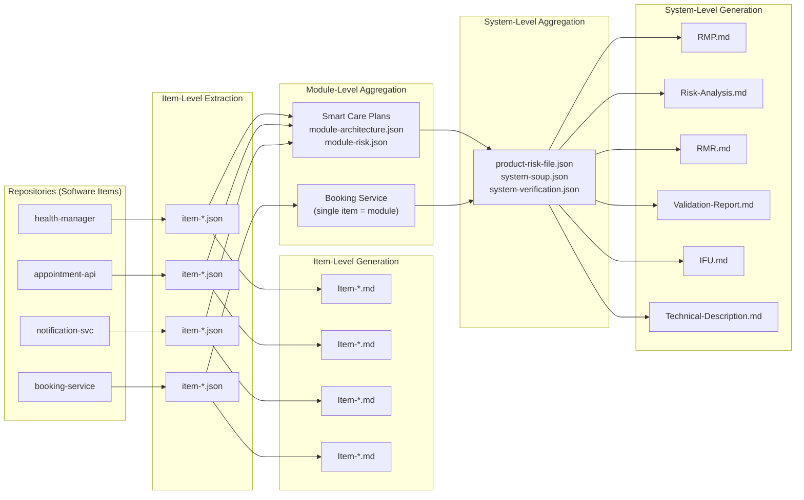
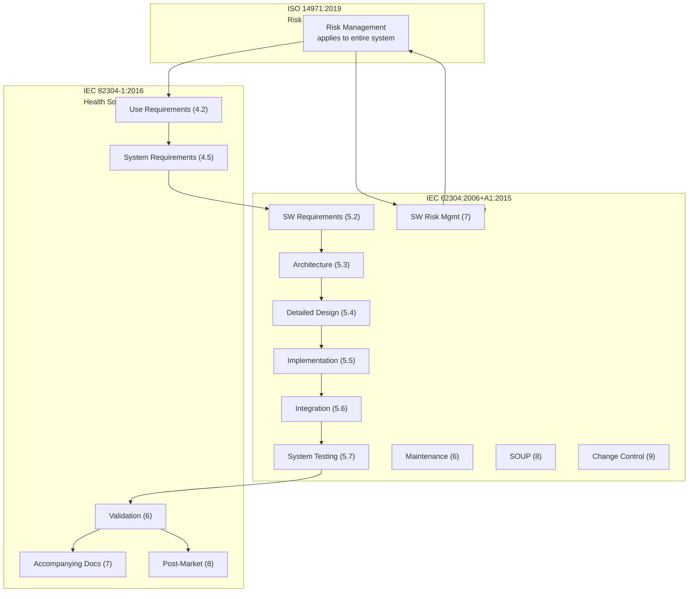
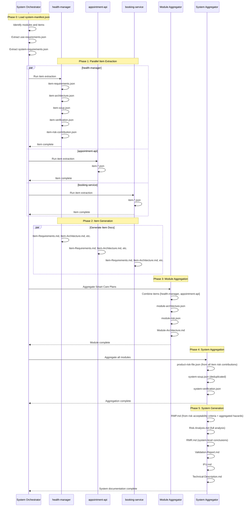

---
id:
title: "Code-as-Truth Documentation Flow Diagram"
version:
author:
effective_date:
type: "Index"
process: "[Document and Record Control](../Canvases/Document%20and%20Record%20Control.canvas)"
requirements:
owner: "[Head of Quality Management](../Assets/Head%20of%20Quality%20Management.md)"
---

# Code-as-Truth Documentation Flow Diagram

This document defines the hierarchical structure and documentation dependencies for health software products. It visualizes how documentation is generated from source code artifacts through extraction, generation, and aggregation phases.

## The Core Problem

**A repository is not necessarily a complete system.**

In real-world medical device software:
- **Triage24** and **Platform24** are *systems* (health software products)
- **Smart Care Plans** is a *module* within those systems
- **health-manager** is a *software item* (single repository) within that module

The documentation framework must support this hierarchy, generating appropriate documentation at each level.

## Three-Level Hierarchy

```
┌─────────────────────────────────────────────────────────────────────────┐
│ SYSTEM (Health Software Product)                   IEC 82304-1 scope   │
│ Examples: Triage24, Platform24                                          │
│ Owns: Use Requirements, Validation, IFU, RMP, RMR                      │
├─────────────────────────────────────────────────────────────────────────┤
│ MODULE (Deployable Component)                      Integration scope    │
│ Examples: Smart Care Plans, Booking Service                            │
│ Owns: Module Architecture, Integration Tests, Cross-Item Interfaces    │
├─────────────────────────────────────────────────────────────────────────┤
│ SOFTWARE ITEM (Repository)                         IEC 62304 scope     │
│ Examples: health-manager, appointment-api, notification-service        │
│ Owns: Item Requirements, Item Architecture, SOUP, Unit Tests, Risks    │
├─────────────────────────────────────────────────────────────────────────┤
│ SOFTWARE UNIT (Class/Function)                     Code scope          │
│ Examples: AppointmentService, HandoverController                       │
│ Owns: Unit tests, code coverage                                        │
└─────────────────────────────────────────────────────────────────────────┘
```

## Concepts and Definitions

### System (Health Software Product)

A **System** is the top-level entity subject to IEC 82304-1 requirements. It represents the complete software product as experienced by users and as registered with regulatory bodies.

A system:
- Has a defined **intended use** describing its health-related purpose
- Has identified **intended users** (patients, clinicians, administrators)
- Operates in a defined **operational environment** (platforms, connectivity)
- **Owns product-level risk management** (ISO 14971 RMP, RMR)
- Requires **validation** against use requirements (IEC 82304-1 clause 6)
- Has **accompanying documentation** (IFU, technical description)
- **Aggregates** module and item outputs

A system contains one or more modules.

### Module (Deployable Component)

A **Module** is a deployable software component that may span one or more repositories. It represents an integration boundary.

A module:
- May contain **multiple software items** (repositories)
- Has defined **inter-item interfaces**
- Has **integration tests** verifying item interactions
- **Aggregates** item-level documentation
- Has a **module safety classification** (highest of its items)

Examples of modules:
- Smart Care Plans (contains health-manager, appointment-api, etc.)
- Patient Portal (contains portal-frontend, portal-api)
- Booking Service (single-item module)

### Software Item (Repository)

A **Software Item** is a single codebase/repository subject to IEC 62304 software lifecycle requirements. **This is the primary extraction target.**

A software item:
- Has **one source code repository**
- Has **item-level requirements** derived from module/system requirements
- Has its own **item architecture** (components within the codebase)
- Has its own **test suite** (unit and item-level integration tests)
- Has its own **SOUP dependencies**
- Has a **software safety classification** (Class A, B, or C)
- **Contributes hazards and controls** to the system risk file

**Key insight:** A repository extraction produces **item-level** documentation, not system-level documentation.

### Software Unit (Class/Function)

A **Software Unit** is the smallest testable element within a software item. Units are internal to the repository and are covered by item-level verification.

### Documentation Ownership

| Level | Owns (Creates) | Aggregates From |
|-------|----------------|-----------------|
| **System** | Use Requirements, System Requirements, RMP, RMR, Risk Analysis, Validation Report, IFU, Technical Description | Modules |
| **Module** | Module Architecture, Integration Tests, Inter-Item Interfaces | Software Items |
| **Software Item** | Item Requirements, Item Architecture, Item SOUP, Item Verification, **Item Risk Contribution** | Code |
| **Software Unit** | Unit tests | N/A |

### What "Risk Contribution" Means

At the **item level**, we extract:
- **Hazard contributions**: Risks this item can cause or propagate
- **Risk controls implemented**: Controls implemented in this codebase
- **Risk controls required upstream**: Controls that must be implemented at module/system level
- **Failure modes**: How this item can fail and the effects
- **Interfaces with safety impact**: External interfaces that affect safety

At the **system level**, we aggregate and assess:
- Overall hazard list (combining item contributions)
- Risk acceptability criteria
- Residual risk evaluation
- Benefit-risk analysis
- Risk management conclusions (RMR)

**A software item does NOT produce a complete RMR** — it produces a risk contribution that feeds into the system RMR.

## Three-Level Hierarchy Diagram



## Aggregation Flow



## What Gets Created at Each Level

### Item Level (Per Repository)

| Extracted JSON | Generated Markdown | Purpose |
|----------------|-------------------|---------|
| `item-requirements.json` | `Item-Requirements.md` | Requirements implemented in this codebase |
| `item-architecture.json` | `Item-Architecture.md` | Components, interfaces within this codebase |
| `item-soup.json` | `Item-SOUP-List.md` | Third-party dependencies |
| `item-verification.json` | `Item-Verification.md` | Unit tests, integration tests |
| `item-risk-contribution.json` | `Item-Risk-Contribution.md` | **Hazards, controls, failure modes** |

### Module Level (Multi-Item)

| Aggregated JSON | Generated Markdown | Purpose |
|-----------------|-------------------|---------|
| `module-architecture.json` | `Module-Architecture.md` | Inter-item interfaces, data flows |
| `module-risk.json` | `Module-Risk.md` | Cross-item hazards, module controls |
| `module-verification.json` | `Module-Integration.md` | Integration test results |

### System Level (Complete Product)

| Aggregated JSON | Generated Markdown | Standard |
|-----------------|-------------------|----------|
| `use-requirements.json` | - | IEC 82304-1 4.2 |
| `system-requirements.json` | `System-SRS.md` | IEC 82304-1 4.5 |
| `product-risk-file.json` | `RMP.md`, `Risk-Analysis.md`, `RMR.md` | ISO 14971 |
| `system-verification.json` | `Validation-Report.md` | IEC 82304-1 6 |
| - | `IFU.md` | IEC 82304-1 7.2.2 |
| - | `Technical-Description.md` | IEC 82304-1 7.2.3 |

## Standards Mapping



## Document Output Structure (Three-Level Hierarchy)

```
platform24/                              # System root
├── docs/
│   ├── system/                          # SYSTEM-LEVEL (IEC 82304-1, ISO 14971)
│   │   ├── extracted/
│   │   │   ├── use-requirements.json
│   │   │   └── system-requirements.json
│   │   ├── aggregated/
│   │   │   ├── product-risk-file.json   # Aggregated from all items
│   │   │   ├── system-soup.json         # Deduplicated SOUP
│   │   │   └── system-verification.json # Aggregated test evidence
│   │   └── generated/
│   │       ├── System-SRS.md
│   │       ├── RMP.md                   # Risk Management Plan
│   │       ├── Risk-Analysis.md         # Full risk analysis
│   │       ├── RMR.md                   # Risk Management Report
│   │       ├── Validation-Report.md
│   │       ├── IFU.md
│   │       └── Technical-Description.md
│   │
│   ├── modules/
│   │   └── smart-care-plans/            # MODULE-LEVEL
│   │       ├── aggregated/
│   │       │   ├── module-architecture.json
│   │       │   ├── module-risk.json
│   │       │   └── module-verification.json
│   │       └── generated/
│   │           ├── Module-Architecture.md
│   │           └── Module-Integration.md
│   │
│   └── items/
│       ├── health-manager/              # ITEM-LEVEL (IEC 62304)
│       │   ├── extracted/
│       │   │   ├── item-requirements.json
│       │   │   ├── item-architecture.json
│       │   │   ├── item-soup.json
│       │   │   ├── item-verification.json
│       │   │   └── item-risk-contribution.json  # NOT full risk file
│       │   └── generated/
│       │       ├── Item-Requirements.md
│       │       ├── Item-Architecture.md
│       │       ├── Item-SOUP-List.md
│       │       ├── Item-Verification.md
│       │       └── Item-Risk-Contribution.md   # NOT RMR
│       │
│       ├── appointment-api/             # Another software item
│       │   ├── extracted/
│       │   │   └── item-*.json
│       │   └── generated/
│       │       └── Item-*.md
│       │
│       └── booking-service/             # Item that is also its own module
│           ├── extracted/
│           │   └── item-*.json
│           └── generated/
│               └── Item-*.md
│
└── config/
    └── system-manifest.json             # Defines hierarchy
```

### System Manifest

The `system-manifest.json` defines the system structure:

```json
{
  "system": {
    "id": "platform24",
    "name": "Platform24 Health Software",
    "version": "2.0.0",
    "safety_class": "C"
  },
  "modules": [
    {
      "id": "smart-care-plans",
      "name": "Smart Care Plans",
      "items": ["health-manager", "appointment-api", "notification-service"],
      "safety_class": "B"
    },
    {
      "id": "booking-service",
      "name": "Booking Service",
      "items": ["booking-service"],
      "safety_class": "A"
    }
  ],
  "items": [
    {
      "id": "health-manager",
      "repository": "https://gitlab.com/platform24/health-manager",
      "module": "smart-care-plans",
      "safety_class": "B"
    },
    {
      "id": "appointment-api",
      "repository": "https://gitlab.com/platform24/appointment-api",
      "module": "smart-care-plans",
      "safety_class": "B"
    },
    {
      "id": "booking-service",
      "repository": "https://gitlab.com/platform24/booking-service",
      "module": "booking-service",
      "safety_class": "A"
    }
  ]
}
```

## Execution Workflow (Three-Level)



## Key Insight: Where Risk Documents Live

| Document | Level | Why |
|----------|-------|-----|
| `item-risk-contribution.json` | Item | Hazards this codebase can cause |
| `Item-Risk-Contribution.md` | Item | Human-readable risk contribution |
| `module-risk.json` | Module | Cross-item risks, module interfaces |
| `product-risk-file.json` | System | **Aggregated** from all items/modules |
| `RMP.md` | System | Risk acceptability criteria (organizational decision) |
| `Risk-Analysis.md` | System | Full hazard analysis (aggregated + system-level) |
| `RMR.md` | System | Overall residual risk conclusion (system decision) |

**An item CANNOT produce an RMR** because:
1. It doesn't know the system's risk acceptability criteria
2. It doesn't know about risks from other items
3. It cannot assess overall residual risk
4. Benefit-risk analysis is a system-level clinical decision

## Module Interface Requirements

When a system contains multiple modules, additional requirements apply:

| Requirement | Standard | Implementation |
|-------------|----------|----------------|
| Inter-module interfaces | IEC 62304 5.2.2 c | Document in each module's architecture.json |
| Shared SOUP | IEC 62304 8.1 | Deduplicate in system-level SOUP list |
| Risk propagation | ISO 14971 7.4 | Trace risks across module boundaries |
| Integration testing | IEC 62304 5.6 | Test module interfaces |
| System testing | IEC 62304 5.7 | Test at system level |
| Validation | IEC 82304-1 6 | Validate against use requirements |

## Traceability Requirements

### Vertical Traceability (Within a Module)

Each module must maintain traceability through its documentation chain:

```
Software Requirement (SRS)
    ↓ traced to
Architecture Component (SAD)
    ↓ traced to
Implementation (code file:line)
    ↓ traced to
Verification Test (SVR)
```

This traceability is captured in the extracted JSON files:
- `requirements.json` links to system requirements and implementation files
- `architecture.json` links to requirements and code locations
- `verification.json` links tests to requirements they verify

### Horizontal Traceability (Across Modules)

Multi-module systems require additional traceability:

```
Module A Requirement          Module B Requirement
        ↘                           ↙
         System Requirement
                ↑
         Use Requirement
```

**Interface traceability**: When Module A calls Module B's API:
- Module A's `architecture.json` documents the external interface dependency
- Module B's `architecture.json` documents the exposed interface
- System-level `interface-matrix.md` maps all inter-module interfaces

**Risk traceability**: Hazards may propagate across modules:
- Module A failure could cause Module B to receive invalid data
- System-level `Product-Risk-File.md` aggregates module risks
- Cross-module hazardous situations are identified at system level

### Traceability Matrix Structure

For multi-module systems, generate a system-level traceability matrix:

| Use Req | System Req | Module | SW Req | Architecture | Test | Status |
|---------|------------|--------|--------|--------------|------|--------|
| USE-001 | SYS-001 | A | SRS-A-001 | SAD-A-001 | TEST-A-001 | Verified |
| USE-001 | SYS-001 | B | SRS-B-001 | SAD-B-001 | TEST-B-001 | Verified |
| USE-002 | SYS-002 | A | SRS-A-002 | SAD-A-002 | TEST-A-002 | Pending |

## Safety Classification in Multi-Module Systems

### Module-Level Classification

Each module receives its own software safety classification (A, B, or C) based on:
- Hazards the module can contribute to
- Severity of potential harm
- Risk control measures implemented elsewhere

A module's classification may differ from the system's overall risk profile. For example:
- **Module A (Backend)**: Class C - processes clinical calculations
- **Module B (Frontend)**: Class B - displays data but doesn't process it
- **Module C (Analytics)**: Class A - no clinical function, reporting only

### Classification Impact on Documentation

| Module Class | Required Documentation |
|--------------|----------------------|
| Class A | SRS, SAD (basic), SVR (basic), Release Notes |
| Class B | SRS, SAD, SOUP List, SVR, SRMF, Release Notes |
| Class C | SRS, SAD, Detailed Design, SOUP List, SVR, SRMF, Release Notes |

The system-level documentation (IEC 82304-1) is required regardless of individual module classifications.

### Segregation Requirements

When modules of different safety classes exist in the same system:
- Higher-class modules must be protected from lower-class modules
- Interfaces between classes must be documented and verified
- Failures in lower-class modules must not compromise higher-class functionality

Document segregation in:
- Each module's `architecture.json` under `segregation` section
- System-level architecture overview
- Risk analysis for cross-module hazards

## Aggregation Rules

### SOUP List Aggregation

When generating the system-level SOUP list:

1. **Collect** all `soup-list.json` from each module
2. **Deduplicate** by package name and version
3. **Merge** functional requirements from all modules using same SOUP
4. **Flag** version conflicts (Module A uses v1.0, Module B uses v2.0)
5. **Aggregate** risk assessments (highest risk from any module applies)

```json
{
  "system_soup_list": [
    {
      "package": "lodash",
      "version": "4.17.21",
      "used_by_modules": ["module-a", "module-b"],
      "highest_risk_class": "B",
      "functional_requirements": {
        "module-a": ["Data manipulation utilities"],
        "module-b": ["Array processing"]
      }
    }
  ],
  "version_conflicts": [
    {
      "package": "axios",
      "module-a": "0.21.0",
      "module-b": "1.4.0",
      "recommendation": "Align to 1.4.0"
    }
  ]
}
```

### Risk File Aggregation

When generating the system-level Product Risk File:

1. **Import** all `software-risk.json` from each module
2. **Identify** cross-module hazardous situations
3. **Trace** module-level controls to system-level hazards
4. **Assess** residual risk at system level
5. **Document** risk-benefit analysis for the complete product

Cross-module risks to consider:
- Data passed between modules could be corrupted
- Module A failure could leave Module B in inconsistent state
- Timing dependencies between modules could cause race conditions
- Security breach in one module could expose data in another

### Validation Report Aggregation

System validation (IEC 82304-1 clause 6) demonstrates the complete product meets use requirements:

1. **Map** each use requirement to system requirements
2. **Trace** system requirements to module verification evidence
3. **Identify** gaps where module verification doesn't cover system needs
4. **Plan** system-level validation tests for gaps
5. **Execute** validation and document results

Validation evidence sources:
- Module SVRs (verification of software requirements)
- System integration tests (interfaces between modules)
- End-to-end tests (user workflows spanning modules)
- User acceptance testing (real-world use scenarios)

## Configuration Management

### Multi-Repository Coordination

For systems with modules in separate repositories:

```
system-config/                    # System-level configuration repo
├── system-requirements.json
├── module-manifest.json          # Lists all modules and versions
├── docs/
│   └── system/
│       ├── Validation-Report.md
│       └── Product-Risk-File.md
└── .github/
    └── workflows/
        └── aggregate-docs.yml    # Aggregates from module repos

module-a/                         # Module A repository
├── src/
├── tests/
├── docs/
│   └── extracted/
│       └── requirements.json
└── .github/
    └── workflows/
        └── extract-docs.yml

module-b/                         # Module B repository
├── src/
├── tests/
├── docs/
│   └── extracted/
│       └── requirements.json
└── .github/
    └── workflows/
        └── extract-docs.yml
```

### Version Alignment

The `module-manifest.json` tracks which module versions comprise a system release:

```json
{
  "system_version": "2.0.0",
  "release_date": "2024-03-15",
  "modules": [
    {
      "name": "module-a",
      "repository": "org/module-a",
      "version": "1.5.2",
      "commit": "abc123",
      "safety_class": "C"
    },
    {
      "name": "module-b",
      "repository": "org/module-b",
      "version": "3.1.0",
      "commit": "def456",
      "safety_class": "B"
    }
  ]
}
```

### Change Impact Across Modules

When a module changes, assess impact on:

| Change In | Assess Impact On |
|-----------|------------------|
| Module A requirements | System requirements, Module B interfaces |
| Module A architecture | Module A risk, integration tests |
| Module A SOUP | System SOUP list, shared vulnerabilities |
| Module A risk controls | System risk file, validation |
| Any module | System version, release notes |

## See Also

- [Orchestration Workflow](_orchestration.md)
- [Unified Coverage Matrix](_unified-coverage-matrix.md)
- [62304 Coverage Matrix](_62304-coverage-matrix.md)
