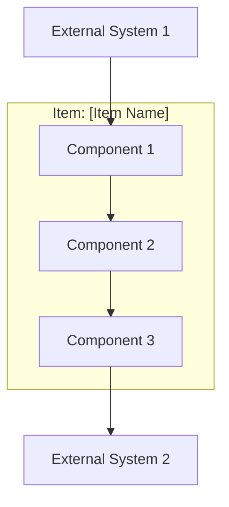
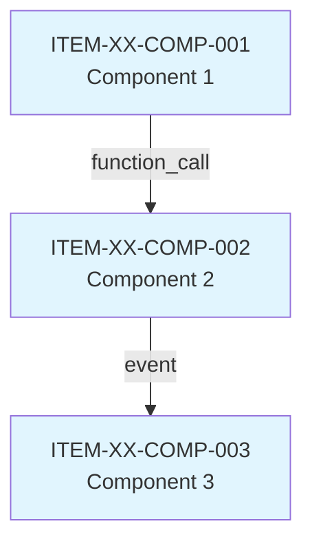

---
id:
title: "Generate Item Architecture Document"
version:
author:
effective_date:
type: "Prompt"
category: "generation"
level: "item"
standard: "IEC 62304"
clause: "5.3"
inputs: ["item-architecture.json"]
outputs: ["Item-Architecture.md"]
software_class: "all"
process: "[Software Development Process](../../../Canvases/Software%20Development%20Process.canvas)"
requirements: "[IEC 62304](../../../Requirements/IEC_62304_Requirements.md)"
owner: "[Head of Quality Management](../../../Assets/Head%20of%20Quality%20Management.md)"
---

# Generate Item Architecture Document

## Context

This prompt generates a human-readable document describing the architecture of a software item. It is explicitly **NOT** a full Software Architecture Design (SAD) — that document is generated at the system level.

**Purpose of this document:**
- Document components within this repository
- Map internal dependencies between components
- Document interfaces provided and consumed
- List SOUP dependencies used
- Describe safety segregation mechanisms
- Support system-level architecture aggregation

## Inputs

### Required
- **`item-architecture.json`** — Output from item-extraction-62304-architecture

### Optional
- **`item-requirements.json`** — For requirement-to-component traceability
- **`item-soup.json`** — For detailed SOUP information
- **`item-risk-contribution.json`** — For component risk impact

## Instructions

Generate a markdown document following the output structure below. The document should:
1. Clearly state this is an item-level document, not a system SAD
2. Visualize component structure (using mermaid diagrams)
3. Document all interfaces with contracts
4. List SOUP dependencies
5. Describe safety measures

## Output Document Structure

```markdown
---
id:
title: "Item Architecture - [Item Name]"
version:
author:
effective_date:
type: "Architecture"
document_id: "ITEM-ARCH-[item-id]-[version]"
level: "item"
process: "[Software Development Process](../../Canvases/Software%20Development%20Process.canvas)"
requirements: "[IEC 62304](../../Requirements/IEC_62304_Requirements.md)"
owner: "[Head of Quality Management](../../Assets/Head%20of%20Quality%20Management.md)"
---

# Item Architecture

## [Item Name]

**Software Item:** [item_id]
**Repository:** [repository URL]
**Version/Commit:** [commit hash]
**Safety Classification:** [Class A/B/C]
**Primary Technology:** [language/framework]
**Architectural Style:** [layered | microkernel | event-driven | etc]
**Extraction Date:** [date]

---

## Important Notice

> This is an **ITEM-LEVEL** document.
>
> This document describes the architecture of **[Item Name]** only.
> It is NOT a Software Architecture Design (SAD).
>
> For complete architecture documentation, see the **System-Level** documents:
> - Software Architecture Design: `SYS-SAD-[system]-[version].md`
> - System Architecture: `SYS-ARCH-[system]-[version].md`

---

## 1. Overview

### 1.1 Architecture Summary

| Metric | Value |
|--------|-------|
| Components | [n] |
| Provided Interfaces | [n] |
| Consumed Interfaces | [n] |
| SOUP Dependencies | [n] |
| Entry Points | [n] |
| Data Flows | [n] |

### 1.2 High-Level Diagram



### 1.3 Entry Points

| Name | Type | Path | Description |
|------|------|------|-------------|
| [name] | [http_server | cli | scheduled_job | message_listener] | [source path] | [description] |

---

## 2. Components

### 2.1 Component Summary

| ID | Name | Type | Safety Class | Dependencies |
|----|------|------|--------------|--------------|
| [ITEM-XX-COMP-001] | [name] | [subsystem | module | layer] | [class] | [n] internal, [n] SOUP |

### 2.2 Component Details

#### [ITEM-XX-COMP-001]: [Component Name]

**Type:** [subsystem | module | layer | package]

**Path:** `[directory path]`

**Description:** [purpose and responsibility]

**Safety Class:** [A | B | C]

**Internal Dependencies:**
| Component | Dependency Type | Coupling | Description |
|-----------|-----------------|----------|-------------|
| [ITEM-XX-COMP-002] | [function_call | event | data] | [tight | loose] | [description] |

**SOUP Dependencies:**
- [ITEM-XX-SOUP-001]: [purpose]
- [ITEM-XX-SOUP-002]: [purpose]

**Source Files:**
- `[path:line-range]`
- `[path:line-range]`

**Related Requirements:**
- [ITEM-XX-REQ-xxx]

---

[Repeat for each component]

---

## 3. Component Dependency Diagram



---

## 4. Provided Interfaces

Interfaces this item EXPOSES to other items/systems.

### 4.1 Summary

| ID | Name | Type | Protocol | Component |
|----|------|------|----------|-----------|
| [ITEM-XX-INT-001] | [name] | [rest_api | jms_topic | grpc] | [HTTP | JMS | etc] | [ITEM-XX-COMP-xxx] |

### 4.2 Interface Details

#### [ITEM-XX-INT-001]: [Interface Name]

**Type:** [rest_api | jms_topic | database | event | grpc]

**Direction:** Provided

**Protocol:** [HTTP | JMS | JDBC | etc]

**Description:** [what this interface does]

**Contract:**
- **Endpoint:** `[URL pattern or topic name]`
- **Method:** [HTTP method if applicable]
- **Request Schema:**
```json
{
  // schema
}
```
- **Response Schema:**
```json
{
  // schema
}
```
- **Error Codes:**
  - [code]: [meaning]

**Provided by Component:** [ITEM-XX-COMP-xxx]

**Known Consumers:** [external items, if known]

**Source:**
- `[path:line-range]`

---

[Repeat for each provided interface]

---

## 5. Consumed Interfaces

Interfaces this item CONSUMES from other items/systems.

### 5.1 Summary

| ID | Name | External System | Protocol | Component |
|----|------|-----------------|----------|-----------|
| [ITEM-XX-EXT-001] | [name] | [system] | [HTTP | JMS] | [ITEM-XX-COMP-xxx] |

### 5.2 Interface Details

#### [ITEM-XX-EXT-001]: [Interface Name]

**Type:** [rest_api | jms_topic | database | event | grpc]

**Direction:** Consumed

**Protocol:** [HTTP | JMS | JDBC | etc]

**External System:** [name of external system/item]

**Description:** [what this interface provides]

**Contract:**
- **Endpoint:** `[URL or topic name]`
- **Expected Schema:**
```json
{
  // expected response
}
```

**Consumed by Component:** [ITEM-XX-COMP-xxx]

**Failure Handling:** [what happens if unavailable]

**Source:**
- `[path:line-range]`

---

[Repeat for each consumed interface]

---

## 6. SOUP Dependencies

### 6.1 Summary

| ID | Name | Version | Purpose | Safety Relevant |
|----|------|---------|---------|-----------------|
| [ITEM-XX-SOUP-001] | [name] | [version] | [purpose] | [yes/no] |

### 6.2 Dependencies by Component

| Component | SOUP Dependencies |
|-----------|-------------------|
| [ITEM-XX-COMP-001] | [SOUP-001], [SOUP-002] |

### 6.3 License Summary

| License | Count | Compatible |
|---------|-------|------------|
| MIT | [n] | Yes |
| Apache-2.0 | [n] | Yes |
| GPL-3.0 | [n] | Review |

> For detailed SOUP information, see: `Item-SOUP-List.md`

---

## 7. Data Flows

### 7.1 Summary

| ID | Name | Safety Relevant | Path |
|----|------|-----------------|------|
| [ITEM-XX-FLOW-001] | [name] | [yes/no] | [COMP-001 -> COMP-002 -> ...] |

### 7.2 Flow Details

#### [ITEM-XX-FLOW-001]: [Flow Name]

**Description:** [what data flows]

**Data Type:** [type of data]

**Safety Relevant:** [yes | no]

**Path:**
```
[ITEM-XX-COMP-001] → [ITEM-XX-COMP-002] → [ITEM-XX-COMP-003]
```

**Data Transformations:**
- At [COMP-001]: [transformation]
- At [COMP-002]: [transformation]

---

## 8. Safety Segregation

### 8.1 Applicability

**Applicable:** [yes | no]

**Rationale:** [why segregation is/is not needed]

### 8.2 Segregation Mechanisms

[If applicable:]

#### Mechanism 1: [Type]

**Type:** [process_isolation | container | thread_boundary | module_boundary]

**Description:** [how segregation is achieved]

**Protected Components:**
- [ITEM-XX-COMP-xxx]

**Verification:** [how it's verified]

### 8.3 Failure Propagation Controls

- [description of control]
- [description of control]

---

## 9. Gaps and Issues

### 9.1 Summary

| Priority | Count |
|----------|-------|
| High | [n] |
| Medium | [n] |
| Low | [n] |

### 9.2 Gap Details

| ID | Type | Description | Affected | Priority | Recommendation |
|----|------|-------------|----------|----------|----------------|
| [ITEM-XX-ARCH-GAP-001] | [type] | [description] | [components] | [priority] | [recommendation] |

---

## 10. Traceability

### 10.1 Component to Requirements

| Component | Requirements |
|-----------|--------------|
| [ITEM-XX-COMP-001] | [REQ-001], [REQ-002] |

### 10.2 Component to Source

| Component | Source Path |
|-----------|-------------|
| [ITEM-XX-COMP-001] | `src/[path]/` |

---

## Appendix A: Extraction Metadata

| Attribute | Value |
|-----------|-------|
| Repository | [repository] |
| Commit | [commit] |
| Extraction Date | [extracted_at] |
| Extractor Version | [extractor_version] |
| Standard | [standard] |

---

*This document is part of the regulatory documentation for [Item Name].*
*IEC 62304:2006+AMD1:2015 Clause 5.3 Compliant — Item Level*
```

## Compliance Checklist

Before finalizing the document:

- [ ] Document clearly states it is item-level, not system SAD 🆔 VAqEmH
- [ ] All components from extraction are documented 🆔 ZgjWvS
- [ ] Component dependencies are mapped 🆔 XwlEA8
- [ ] Provided interfaces have contracts 🆔 wG3bsy
- [ ] Consumed interfaces document failure handling 🆔 SWkSIl
- [ ] SOUP dependencies are listed 🆔 nx9xNr
- [ ] Safety segregation is addressed 🆔 Cx7Pkb
- [ ] Data flows are documented 🆔 SnTGWI
- [ ] Gaps are identified 🆔 OSATgf
- [ ] Diagrams are readable 🆔 8ciel4

## Validation Criteria

- [ ] Document follows the prescribed structure 🆔 YPkShU
- [ ] All sections populated from extracted JSON 🆔 MJYHHL
- [ ] Mermaid diagrams render correctly 🆔 LK5TFM
- [ ] Missing data flagged with [TODO] markers 🆔 gKFL56
- [ ] Important notice about document scope is prominent 🆔 T0frbV
- [ ] References to system-level documents are included 🆔 LccgQo
- [ ] Document is readable by software architects 🆔 sx5E3Y
